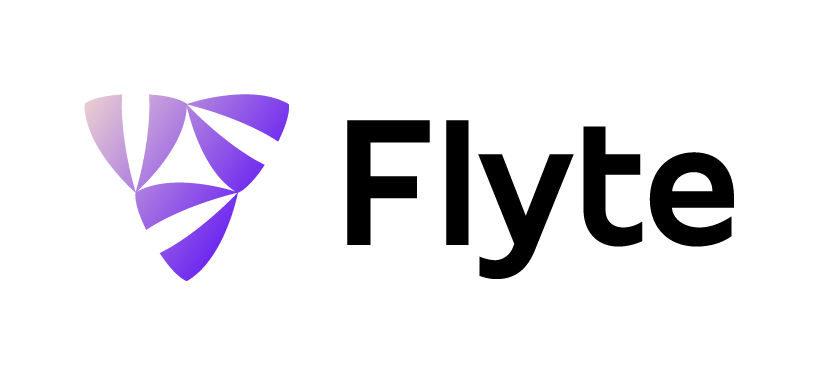

Flyte is a container-native, type-safe workflow and pipelines platform optimized for large scale processing and machine learning written in Golang. Workflows can be written in any language, with out of the box support for Python. 

# Homepage
https://flyte.org
Docs: https://lyft.github.io/flyte

# Introduction
Flyte is a fabric that connects disparate computation backends using a type safe data dependency graph. It records all changes to a pipeline, making it possible to rewind time. It also stores
a history of all executions and provides an intuitive UI, CLI and REST/gRPC API to interact with the computation.

Flyte is more than a workflow engine, it provides workflows as a core concepts, but it also provides a single unit of execution - tasks, as a top level concept. Multiple tasks arranged in a data
producer-consumer order creates a workflow. Flyte workflows are pure specification and can be created using any language. Every task can also by any language. We do provide first class support for
python, making it perfect for modern Machine Learning and Data processing pipelines.

# Resources
Resources that would help you get a better understanding of Flyte.

## Conference Talks
- Kubecon 2019 - Flyte: Cloud Native Machine Learning and Data Processing Platform [video](https://www.youtube.com/watch?v=KdUJGSP1h9U) | [deck](https://kccncna19.sched.com/event/UaYY/flyte-cloud-native-machine-learning-data-processing-platform-ketan-umare-haytham-abuelfutuh-lyft)
- Kubecon 2019 - Running LargeScale Stateful workloads on Kubernetes at Lyft [video](https://www.youtube.com/watch?v=ECeVQoble0g)
- re:invent 2019 - Implementing ML workflows with Kubernetes and Amazon Sagemaker  [video](https://youtu.be/G-wzIQQJKaE)
- Cloud-native machine learning at Lyft with AWS Batch and Amazon EKS [video](https://youtu.be/n_rRb8u1GSM)

## Blog Posts
 1. [Introducing Flyte: A Cloud Native Machine Learning and Data Processing Platform](https://eng.lyft.com/introducing-flyte-cloud-native-machine-learning-and-data-processing-platform-fb2bb3046a59)

## Podcasts
- TWIML&AI -  [Scalable and Maintainable ML Workflows at Lyft - Flyte](https://twimlai.com/twiml-talk-343-scalable-and-maintainable-workflows-at-lyft-with-flyte-w-haytham-abuelfutuh-and-ketan-umare/)
- Software Engineering Daily - [Flyte: Lyft Data Processing Platform](https://softwareengineeringdaily.com/2020/03/12/flyte-lyft-data-processing-platform-with-allyson-gale-and-ketan-umare/)

# Features
 - Used at Scale in production by 500+ users at Lyft with more than *900k* workflow executed a month and more than *30+* million container executions per month
 - Centralized Inventory of Tasks, Workflows and Executions
 - Single Task Execution support - Start executing a task and then convert it to a workflow
 - gRPC / REST interface to define and executes tasks and workflows
 - Type safe construction of pipelines, each task has an interface which is characterized by its input and outputs. Thus illegal construction of pipelines fails during declaration rather than at
   runtime
 - Types that help in creating machine learning and data processing pipelines like - Blobs (images, arbitrary files), Directories, Schema (columnar structured data), collections, maps etc
 - Memoization and Lineage tracking
 - Workflows features
  * Multiple Schedules for every workflow
  * Parallel step execution
  * Extensible Backend to add customized plugin experiences
  * Arbitrary container execution
  * Branching
  * Inline Subworkflows (a workflow can be embeded within one node of the top level workflow)
  * Distributed Remote Child workflows (a remote workflow can be triggered and statically verified at compile time)
  * Array Tasks (map some function over a large dataset, controlled execution of 1000's of containers)
  * Dynamic Workflow creation and execution - with runtime type safety
  * Container side plugins with first class support in python
 - Maintain an inventory of tasks and workflows
 - Record history of all executions and executions (as long as they follow convention) are completely repeatable
 - Multi Cloud support (AWS, GCP and others)
 - Extensible core
 - Modularized
 - Automated notifications to Slack, Email, Pagerduty
 - Deep observability
 - Multi K8s cluster support
 - Comes with many system supported out of the box on K8s like Spark etc.
 - Snappy Console
 - Python CLI
 - Written in Golang and optimized for performance

## Coming Soon
 - Reactive pipelines
 - Golang CLI
 - Grafana templates (user/system observability)
 - Arbitrary flytekit less container support
 - More integrations

# Available Plugins
 - Containers
 - K8s Pods
 - AWS Batch Arrays
 - K8s Pod arrays
 - K8s Spark (native pyspark and java/scala)
 - Qubole Hive
 - Presto Queries
 - Pytorch Operator

## Coming soon
 - Sagemaker
 - Flink-K8s

# Current Usage 
- Lyft Rideshare
- Lyft L5 autonomous
- Juno

# Changelogs
[Changelogs](CHANGELOG/README.md)

# Biweekly Community Sync
- Starting April 21 2020, the Flyte community meets every other Tuesday at 9:00 AM PST (US West coast time).
- You can join the [google meet](meet.google.com/rbn-rvcv-odx). 
- Meeting notes are captured in [Doc](https://docs.google.com/document/d/1Jb6eOPOzvTaHjtPEVy7OR2O5qK1MhEs3vv56DX2dacM/edit#heading=h.c5ha25xc546e)
- Demo Signup [Sheet](https://docs.google.com/spreadsheets/d/1Bz-s3SpMm1hGl6Z5y3HcxrNBcg9ZhSgqVgmCxK_eEhs/edit#gid=0)

# Component Repos 
Repo | Language | Purpose
--- | --- | ---
[flyte](https://github.com/lyft/flyte) | Kustomize,RST | deployment, documentation, issues
[flyteidl](https://github.com/lyft/flyteidl) | Protobuf | interface definitions
[flytepropeller](https://github.com/lyft/flytepropeller) | Go | execution engine
[flyteadmin](https://github.com/lyft/flyteadmin) | Go | control plane
[flytekit](https://github.com/lyft/flytekit) | Python | python SDK and tools
[flyteconsole](https://github.com/lyft/flyteconsole) | Typescript | admin console
[datacatalog](https://github.com/lyft/datacatalog) | Go  | manage input & output artifacts
[flyteplugins](https://github.com/lyft/flyteplugins) | Go  | flyte plugins
[flytestdlib](https://github.com/lyft/flytestdlib) |  Go | standard library
[flytesnacks](https://github.com/lyft/flytesnacks) | Python | examples, tips, and tricks

# Production K8s Operators

Repo | Language | Purpose
--- | --- | ---
[Spark](https://github.com/GoogleCloudPlatform/spark-on-k8s-operator) | Go | Apache Spark batch
[Flink](https://github.com/lyft/flinkk8soperator) | Go | Apache Flink streaming
