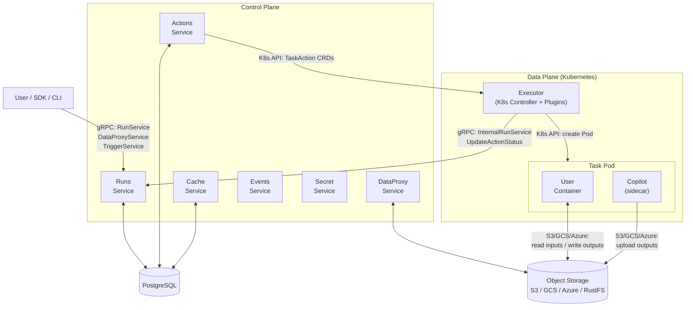
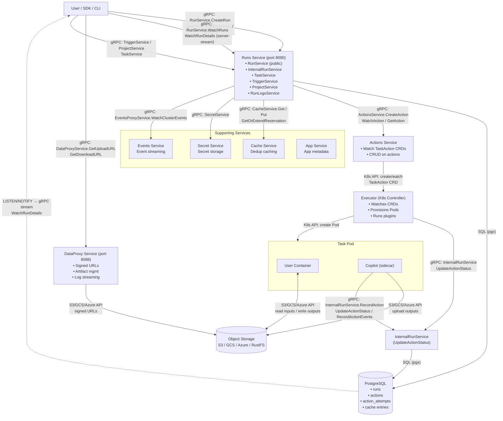
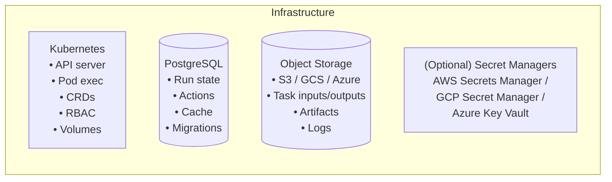
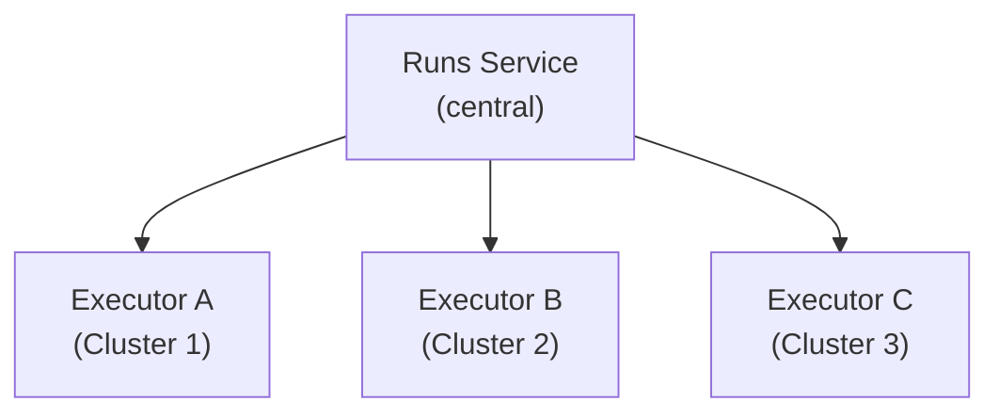

# Flyte 2 System Architecture

**Reliably orchestrate ML pipelines, models, and agents at scale — in pure Python.**

This document describes the backend architecture of Flyte 2: its major components, how data flows through the system, and the role each component plays.

---

## Table of Contents

- [High-Level Overview](#high-level-overview)
- [System Architecture Diagram](#system-architecture-diagram)
- [Data Flow](#data-flow)
- [Component Reference](#component-reference)
  - [Runs Service](#runs-service)
  - [Executor Service](#executor-service)
  - [Actions Service](#actions-service)
  - [DataProxy Service](#dataproxy-service)
  - [Cache Service](#cache-service)
  - [Events Service](#events-service)
  - [Secret Service](#secret-service)
  - [App Service](#app-service)
  - [Flyte Copilot](#flyte-copilot)
  - [Manager (Unified Binary)](#manager-unified-binary)
- [Shared Libraries](#shared-libraries)
  - [flytestdlib](#flytestdlib)
  - [flyteplugins](#flyteplugins)
  - [flyteidl2 (IDL)](#flyteidl2-idl)
- [Plugin System](#plugin-system)
- [Infrastructure Dependencies](#infrastructure-dependencies)
- [API Surface](#api-surface)
- [Deployment Modes](#deployment-modes)
- [Security](#security)

---

## High-Level Overview

Flyte 2 is a Kubernetes-native workflow orchestration platform. The backend is a collection of Go microservices that communicate over **gRPC (buf connect)**, persist state in **PostgreSQL**, execute tasks as **Kubernetes Pods**, and store artifacts in **object storage** (S3 / GCS / Azure Blob / RustFS).



---

## System Architecture Diagram



### gRPC Calls Between Components

Summary of the gRPC wiring shown in the diagram above:

| From | To | Service | Key RPCs | Direction |
|------|----|---------|----------|-----------|
| Client / SDK | Runs Service | `RunService` | CreateRun, AbortRun, GetRunDetails, ListRuns | unary |
| Client / SDK | Runs Service | `RunService` | WatchRuns, WatchRunDetails | server-stream |
| Client / SDK | Runs Service | `TaskService` | GetTask, ListTasks | unary |
| Client / SDK | Runs Service | `TriggerService` | CreateTrigger, GetTrigger, ListTriggers | unary |
| Client / SDK | Runs Service | `ProjectService` | GetProject, ListProjects | unary |
| Client / SDK | Runs Service | `RunLogsService` | TailLogs | server-stream |
| Client / SDK | DataProxy | `DataProxyService` | GetUploadURL, GetDownloadURL, GetArtifact | unary |
| Runs Service | Actions Service | `ActionsService` | CreateAction, GetAction, WatchAction | unary / stream |
| Runs Service | Cache Service | `CacheService` | Get, Put, Delete, GetOrExtendReservation | unary |
| Runs Service | Events Service | `EventsProxyService` | WatchClusterEvents | server-stream |
| Runs Service | Secret Service | `SecretService` | Get, Put | unary |
| Executor / Copilot | Runs Service | `InternalRunService` | RecordAction, UpdateActionStatus, RecordActionEvents | unary |
| Actions Service | Kubernetes | K8s API | Create/Watch `TaskAction` CRD | watch |
| Executor | Kubernetes | K8s API | Create/Watch Pods | watch |
| User container / Copilot | Object Storage | S3 / GCS / Azure | Get/Put object | REST |
| DataProxy | Object Storage | S3 / GCS / Azure | Sign URL | REST |

All gRPC traffic uses **buf connect** (HTTP/2 with HTTP/1.1 fallback).

---

## Data Flow

### End-to-End Execution

The following describes what happens when a user submits a workflow:

```
 Step   What happens                                            Where
 ────   ────────────────────────────────────────────────────     ─────────────────
  1     User calls RunService.CreateRun()                       Client → Runs Service
  2     Run record + root action written to PostgreSQL          Runs Service → DB
  3     Runs Service calls ActionsService.CreateAction()        Runs Service → Actions Service
  4     Actions Service creates TaskAction CRD in Kubernetes    Actions Service → K8s
  5     Executor controller sees the CRD                        Executor
  6     Plugin resolves task spec, creates Pod + Copilot        Executor → K8s
  7     Copilot init-container downloads inputs from storage    Copilot → Object Storage
  8     User container executes; reads inputs / writes outputs  User container ↔ Object Storage
  9     Copilot sidecar uploads remaining outputs to storage    Copilot → Object Storage
 10     Executor calls InternalRunService.UpdateActionStatus()  Executor → Runs Service
 11     Action status updated in PostgreSQL                     Runs Service → DB
 12     Client receives update via WatchRunDetails() stream     Runs Service → Client
```

### Data Access (Artifacts)

```
Client ──GetUploadURL()──▶ DataProxy ──▶ Signed URL
Client ──PUT───────────────────────────▶ Object Storage

Client ──GetDownloadURL()──▶ DataProxy ──▶ Signed URL
Client ──GET────────────────────────────▶ Object Storage
```

### Caching (Deduplication)

```
Executor ──lookup(task_key)──▶ Cache Service
         ◀── HIT: cached output ──┘
         ◀── MISS ────────────────┘
              │
              ▼ (execute task, then)
Executor ──put(task_key, output)──▶ Cache Service
```

---

## Component Reference

### Runs Service

| | |
|---|---|
| **Source** | `/runs` |
| **Entry point** | `runs/cmd/main.go` |
| **Default port** | 8090 |
| **Database** | PostgreSQL (runs, actions, action_attempts tables) |

The central control-plane service. It owns the **run lifecycle**: creation, monitoring, abort, and streaming of status updates. It exposes both public APIs (for users/SDKs) and internal APIs (for the Executor).

**Public gRPC services:**
- `RunService` — CreateRun, AbortRun, GetRunDetails, WatchRunDetails, ListRuns, WatchRuns
- `TaskService` — GetTask, ListTasks
- `TriggerService` — manage triggers for scheduled/event-driven runs
- `ProjectService` — project and domain management
- `RunLogsService` — stream pod logs from Kubernetes

**Internal gRPC services:**
- `InternalRunService` — RecordAction, UpdateActionStatus, RecordActionEvents (used by the Executor)
- `TranslatorService` — convert between execution models

---

### Executor Service

| | |
|---|---|
| **Source** | `/executor` |
| **Entry point** | `executor/cmd/main.go` |
| **Type** | Kubernetes controller (no HTTP port) |

A **Kubernetes controller** that watches `TaskAction` CRDs and executes them as Pods. It uses the **plugin system** to handle different task types (container, Spark, Ray, Dask, etc.).

**Responsibilities:**
- Watch TaskAction custom resources
- Resolve task specifications and select the appropriate plugin
- Create Pods with the user container + Flyte Copilot sidecar
- Monitor pod lifecycle and capture execution status
- Report results back to the Runs Service via `InternalRunService`
- Handle admission webhooks for pod validation/mutation

**CRD:** `TaskAction` — defined in `executor/api/v1/taskaction_types.go`

---

### Actions Service

| | |
|---|---|
| **Source** | `/actions` |

Bridges the Runs Service and Kubernetes. It watches `TaskAction` CRDs and provides CRUD operations and streaming status updates on actions.

**gRPC service:** `ActionsService` — GetAction, WatchAction, CreateAction

---

### DataProxy Service

| | |
|---|---|
| **Source** | `/dataproxy` |
| **Default port** | 8088 |

Manages **artifact storage and data access**. Generates time-limited signed URLs so clients can upload/download data directly from object storage without exposing credentials.

**gRPC services:**
- `DataProxyService` — GetUploadURL, GetDownloadURL, GetArtifact
- `ClusterService` — cluster capability queries

---

### Cache Service

| | |
|---|---|
| **Source** | `/cache_service` |

Provides **deterministic task deduplication**. When a task with identical inputs has already run, the cache returns the stored output instead of re-executing.

**gRPC service:** `CacheService` — Get, Put, Delete, GetOrExtendReservation

---

### Events Service

| | |
|---|---|
| **Source** | `/events` |

Aggregates execution events from all sources and streams them to subscribers. Useful for building dashboards, audit logs, and external integrations.

**gRPC service:** `EventsProxyService` — WatchClusterEvents

---

### Secret Service

| | |
|---|---|
| **Source** | `/secret` |

Centralized secret management. Stores and retrieves secrets, with optional integration to cloud secret managers (AWS Secrets Manager, GCP Secret Manager, Azure Key Vault).

---

### App Service

| | |
|---|---|
| **Source** | `/app` |

Serves application metadata and configurations for long-running services (model serving, apps).

**gRPC services:**
- `AppService` — GetApp, ListApps
- `AppLogsService` — stream app logs

---

### Flyte Copilot

| | |
|---|---|
| **Source** | `/flytecopilot` |

A **sidecar binary** injected into every task pod. Operates in two modes:

| Mode | Phase | What it does |
|------|-------|--------------|
| **Downloader** | Init container | Fetches task metadata and input data from object storage before the user container starts |
| **Sidecar** | Runtime | Monitors the user container, uploads outputs to object storage after execution completes |

---

### Manager (Unified Binary)

| | |
|---|---|
| **Source** | `/manager` |
| **Entry point** | `manager/cmd/main.go` |

Runs **all services in a single process** for simplified deployment. Aggregates Runs, Executor, Actions, DataProxy, Events, Cache, and Secret services into one binary.

---

## Shared Libraries

### flytestdlib

| | |
|---|---|
| **Source** | `/flytestdlib` |

Shared infrastructure library used by all services:

| Module | Purpose |
|--------|---------|
| `database` | PostgreSQL connectivity (pgx/gorm) |
| `storage` | Object storage abstraction (S3, GCS, Azure, RustFS) |
| `logger` | Structured logging with request context |
| `config` | Configuration management (flags, YAML, env vars) |
| `app` | Service framework (HTTP server, graceful shutdown, health checks) |
| `promutils` | Prometheus metrics helpers |
| `k8s` | Kubernetes client utilities |
| `cache` | In-memory caching (freecache, redis) |
| `grpcutils` | gRPC interceptors and utilities |

---

### flyteplugins

| | |
|---|---|
| **Source** | `/flyteplugins` |

The plugin framework and built-in plugins for task execution. See [Plugin System](#plugin-system) below.

---

### flyteidl2 (IDL)

| | |
|---|---|
| **Source** | `/flyteidl2` |
| **Generated code** | `/gen/go/flyteidl2/` |

Protocol Buffer definitions for all APIs. Organized into sub-packages:

| Package | Contents |
|---------|----------|
| `core` | TaskTemplate, Literal, TaskSpec |
| `workflow` | Run, Action, RunSpec |
| `task` | Task execution and metadata |
| `common` | Identifier, Phase, InputOutput |
| `cacheservice` | Cache entry types |
| `dataproxy` | Signed URL request/response |
| `actions` | Action management types |
| `auth` | Authentication/authorization |
| `app` | Application service types |
| `trigger` | Trigger and scheduling |
| `plugins` | Plugin-specific configs (Spark, Ray, Dask) |

---

## Plugin System

Plugins extend the Executor to handle different task types. When a task is submitted, the Executor matches the `task_type` field to a registered plugin.

### Plugin Lifecycle

```
TaskAction CRD arrives
        │
        ▼
Executor looks up plugin by task_type
        │
        ▼
Plugin validates task spec
        │
        ▼
Plugin creates K8s resource (Pod / SparkApplication / RayJob / ...)
        │
        ▼
Plugin monitors execution
        │
        ▼
Plugin captures outputs
        │
        ▼
Plugin reports status → InternalRunService
```

### Built-in Plugins

| Category | Plugin | Description |
|----------|--------|-------------|
| **K8s** | Pod | Standard container execution (default) |
| **K8s** | Spark | Distributed Spark jobs |
| **K8s** | Ray | Ray cluster jobs |
| **K8s** | Dask | Dask distributed computing |
| **K8s** | Kubeflow | Training operators (TF, PyTorch, MPI) |
| **Core** | Container | OCI container execution |
| **Web API** | HTTP | REST-based task execution |
| **AWS** | Batch | AWS Batch job submission |
| **AWS** | Athena | SQL query execution |
| **AWS** | SageMaker | ML model training/inference |

**Source:** `/flyteplugins/go/tasks/plugins/`

**Plugin machinery** (base interfaces): `/flyteplugins/go/tasks/pluginmachinery/`

---

## Infrastructure Dependencies



| Dependency | Role | Required? |
|------------|------|-----------|
| **Kubernetes** | Task execution, CRD storage, RBAC, pod scheduling | Yes |
| **PostgreSQL** | Persistent state for runs, actions, cache entries | Yes |
| **Object Storage** | Artifact storage (inputs, outputs, logs) | Yes |
| **Secret Manager** | External secret backend (AWS/GCP/Azure) | Optional (falls back to K8s secrets) |

---

## API Surface

All APIs use **buf connect** (gRPC over HTTP/2 and HTTP/1.1).

### User-Facing APIs

| Service | Proto Path | Key RPCs |
|---------|-----------|----------|
| RunService | `flyteidl2.workflow.RunService` | CreateRun, AbortRun, GetRunDetails, WatchRunDetails, ListRuns, WatchRuns |
| TaskService | `flyteidl2.task.TaskService` | GetTask, ListTasks |
| DataProxyService | `flyteidl2.dataproxy.DataProxyService` | GetUploadURL, GetDownloadURL, GetArtifact |
| CacheService | `flyteidl2.cacheservice.CacheService` | Get, Put, Delete, GetOrExtendReservation |
| TriggerService | `flyteidl2.trigger.TriggerService` | CreateTrigger, GetTrigger, ListTriggers |
| ProjectService | `flyteidl2.project.ProjectService` | GetProject, ListProjects |
| AuthService | `flyteidl2.auth.AuthService` | OAuth/OIDC endpoints |

### Internal APIs (component-to-component)

| Service | Proto Path | Key RPCs |
|---------|-----------|----------|
| InternalRunService | `flyteidl2.workflow.InternalRunService` | RecordAction, UpdateActionStatus, RecordActionEvents |
| ActionsService | `flyteidl2.actions.ActionsService` | GetAction, WatchAction, CreateAction |
| EventsProxyService | `flyteidl2.workflow.EventsProxyService` | WatchClusterEvents |
| AppService | `flyteidl2.app.AppService` | GetApp, GetAppLogs |
| ClusterService | `flyteidl2.cluster.ClusterService` | GetCluster |

### Communication Patterns

| Pattern | Example |
|---------|---------|
| **Synchronous gRPC** | Client → RunService.CreateRun, Executor → InternalRunService.UpdateActionStatus |
| **Server-streaming gRPC** | RunService.WatchRunDetails, EventsProxyService.WatchClusterEvents |
| **K8s Watch** | Executor watches TaskAction CRDs, Actions Service watches TaskAction CRDs |

---

## Deployment Modes

### Unified Mode (Single Binary)

All services run in one process via the **Manager** binary. Suitable for development, testing, and small-scale production.

```
Client ──▶ Manager:8090 ──▶ [All services in-process, no network hops]
```

```bash
# Single container runs everything
flyte --config config.yaml
```

### Split Mode (Multiple Binaries)

Each service runs independently for horizontal scaling and isolation.

```
Client ──▶ Runs:8090
            ├──▶ Actions Service
            ├──▶ DataProxy:8088
            ├──▶ Cache Service
            └──▶ Executor (via K8s CRDs)
```

### Multi-Cluster

Executors run on multiple Kubernetes clusters, all reporting to a central Runs Service. TaskAction CRDs include a `cluster` field to route execution.



### Helm Chart

Production Kubernetes deployment via `/charts/flyte-binary/`.

---

## Security

| Layer | Mechanism |
|-------|-----------|
| **Authentication** | Optional OAuth/OIDC via AuthService |
| **Pod identity** | Kubernetes ServiceAccount tokens |
| **Transport** | TLS for all gRPC connections (configurable) |
| **Data access** | Time-limited signed URLs from DataProxy |
| **Secrets** | Centralized Secret Service with external vault integration |
| **Authorization** | Kubernetes RBAC for CRD operations; project-level access control |

---

## Key Source Locations

| What | Path |
|------|------|
| Unified binary entry point | `manager/cmd/main.go` |
| Runs Service | `runs/` |
| Executor controller | `executor/` |
| Actions Service | `actions/` |
| DataProxy Service | `dataproxy/` |
| Cache Service | `cache_service/` |
| Events Service | `events/` |
| Secret Service | `secret/` |
| App Service | `app/` |
| Copilot sidecar | `flytecopilot/` |
| IDL (proto definitions) | `flyteidl2/` |
| Generated Go code | `gen/go/flyteidl2/` |
| Plugin framework | `flyteplugins/go/tasks/pluginmachinery/` |
| Built-in plugins | `flyteplugins/go/tasks/plugins/` |
| Shared library | `flytestdlib/` |
| Helm chart | `charts/flyte-binary/` |
| Dockerfile | `Dockerfile` |
