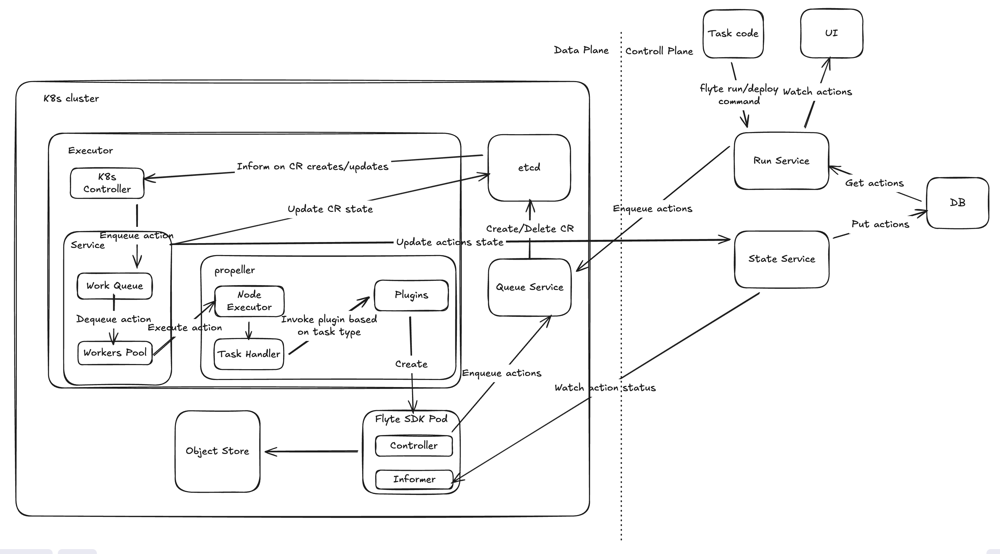

# Component Architecture

This document aims to provide a high level overview of different components in Flyte v2.

<!-- TODO: Maybe need to add a new figure splitting into User/Control/Data plane? -->

- User plane
    - Flyte-sdk
    - Flyte console (UI)
- Control plane
    - Run Service
    - Queue Service
    - State Service
- Data plane
    - Executor

## User Plane

### Flyte-SDK

It's the Python SDK for user to build their flyte tasks. Everything is in pure Python, no workflow DAG.

### Flyte console

A well-design UI interface for viewing tasks, runs, triggers, etc. 

## System Structure

[Excalidraw link](https://excalidraw.com/#room=2d2b7c70744a9260f0e1,D-qEq5oOXJ4DX0vHp9-tUQ)

## Control plane

### Run Service and Task Service

These services handle CRUD operations for Runs and Tasks, reading and storing data to PostgreSQL. They are the
services for user queries like listing runs or inspecting specific execution states.

- **Run Service**: Communicates with the Queue Service via internal RPC. When the user plane sends an execution
request, it lands in the queue service first, which then pushes the run data to the run service for storage.

- **Task Service**: Similar to the run service but dedicated to task management. It is not involved during
standard `flyte run` executions. Instead, it handles flyte deploy operations, where it versions and persists
task definitions to the database without executing them.

### Queue Service

This component functions as the centralized work queue for Flyte v2. In v1, the queue service lies within
Flyte Propeller in the data plane. In v2, it has been moved to the control plane to enable centralized
management of multi-cluster environments. This migration simplifies the architecture: the control plane
handles scheduling across various clusters, while the data plane executor focuses solely on executing tasks.

When receiving an `enqueue action` request from clients, the queue service generates an action Custom Resource
(CR) and persists it to etcd (key-value store used in Kubernetes). The service maintains a registry of all
available data plane executors and routes the action CR to the most suitable instance for execution.

## Data plane

### Executor

The Executor acts as the core engine responsible for running tasks within the data plane. It leverages the
Kubernetes Operator pattern to poll the API and reconcile action CRs whenever changes occur. It monitors and
reconciles action CRs (Custom Resources) and execute the tasks.

To deal with a wide variety of tasks, the Executor utilizes a modular plugin architecture. It dynamically
selects and invokes the specific plugin required for the job based on the defined Task Type.

- For example: If the task requires a standard container execution, the executor triggers the pod plugin to
provision and manage the lifecycle of the pods.
