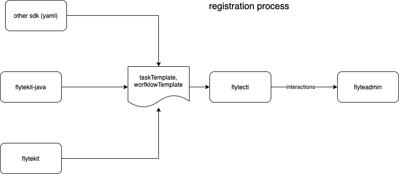

# Introduction

This document proposes, **flytectl** as one singular CLI that interacts with flyteadmin service. It is proposed to write the CLI in **Golang** and would support both gRPC and REST endpoints of
FlyteAdmin. We will start with gRPC endpoint as the client is easily generated and in future we should investigate generation of a Swagger based REST client from the gRPC specification. As we build
more SDK's in different languages we should support a common way of interacting with the API. This does no mean that some SDK's may provide native ways of interacting with the Admin API (for e.g.
flytekit), but the intention is that we will eventually replace **flytekit/flyte-cli** with flytectl exclusively.

We also recommend that the design of flytectl is careful and it could helps us with delivering user features faster without having to rely on the UI. flytectl with follow standard oauth2 for
authentication already supported by flyteAdmin. Moreover, flytectl should be readily available on almost any platform - OSX, Linux and Windows. We will strive to keep it relatively lean and fast.

# Why One CLI?

As we build multiple SDK's they need a native way of interacting with the API. Having multiple CLI's makes it hard to keep all of them in sync as we rapidly evolve the API and add more features.

*Diagram here*


# Why Golang?
- Most of Flytebackend is written in golang
- Golang offers great CLI tooling support with viper and cobra
- Golang toolchain to create cross-compiled small, light weight binary is really efficient and easy to use
- We already generate golang proto and clients for all our IDL
- we have multiple common libraries available to ease the development of this tool
- kubectl is a stellar example of a cli done well

## Generating Swagger code
We started exploring this (flytetools)[https://github.com/lyft/flytetools#tools] has some work. We also got approached by the swagger code gen maintainer to see if they can help.

# API

## Top level commands

```bash
$ flytectl [options]
  version
  configure
  get
  create
  update
  delete 
```

### base options
- *endpoint* endpoint where flyteadmin is available
- *insecure* use if Oauth is not available
- optional *project* project for which we need to retrieve details
- optional *domain* domain for which we need to retrieve details
- TBD

### version
returns the version of the CLI, version of Admin service and version of the Platform that is deployed

### configure
Allows configuring flytectl for your own usage (low pri). Needed for especially storing Auth tokens.

### get/delete
Get retrieves a list of resources that is qualified by a further sub-command. for example
```bash
$ flytectl --endpoint "example.flyte.net" get projects
$ flytectl --endpoint "example.flyte.net" --project "p" --domain "d" delete workflows
```
This returns a list of projects

To retrieve just one project
```bash
$ flytectl --endpoint "example.flyte.net" get projects <project-name>
$ flytectl --endpoint "example.flyte.net" --project "p" --domain "d" delete workflows "W1"
```

### Create is special
Create may need more information than can be easily passed in command line and we recommend using files to create an entity. The file could be in protobuf, jsonpb (json) or jsonpb (yaml) form.
Eventually we may want to simplify the json and yaml representations but that is not required in first pass. We may also want to create just a separate option for that.

The create for Task and Workflow is essential what is encompassed in the pyflyte as the registration process. We will decouple the registration process such that pyflyte, jflyte (other native cli's or
code methods) can dump a serialized representations of the workflows and tasks that are directly consumed by **flytectl**. Thus flytectl is essential in every flow for the user.



### update
This is a lower priority option as most entities in flyte are immutable and do not support updates. For the ones where update is supported, we should look into retrieving the existing and allow editing in an editor, like kubectl edit does.

**To be specified**


# Details of each resource

## Projects
Support
 - create
 - get
 - update

## Tasks
Support
 - create
 - get
 - update

## Workflows
Support
 - create
 - get
 - update

## Launch Plans
Support
 - create
 - get
 - update

## Execution
Support
 - create
 - get
 - update
 - delete - here refers to terminate

## MatchableEntity
Support
 - create
 - get
 - update

## Outputs
Support
 - create
 - get
 - update

