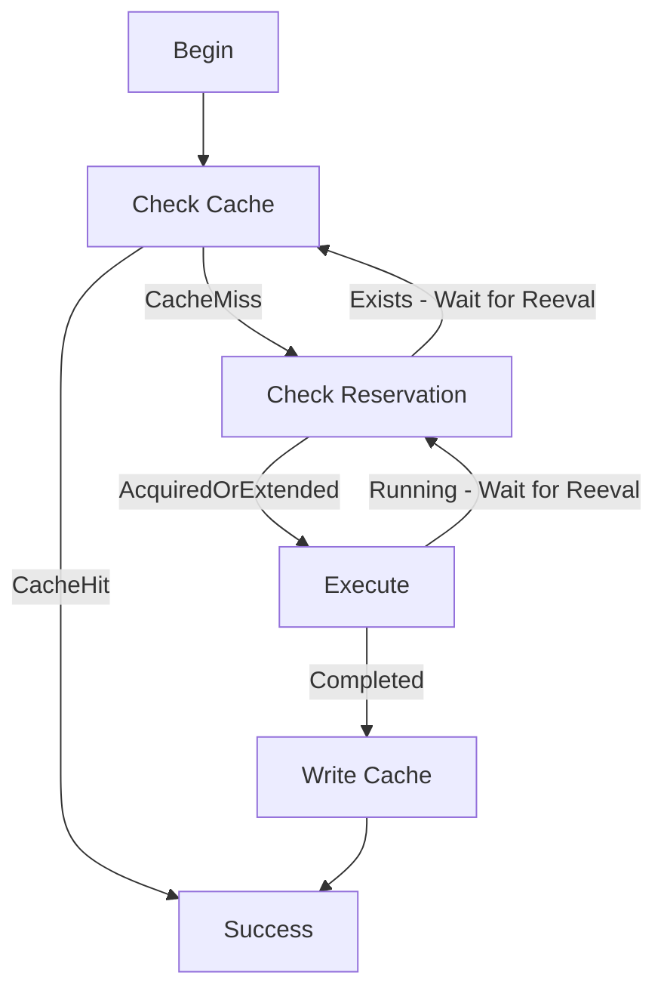

# [RFC] Cache Serialize API

**Authors:**

- @hamersaw 

## 1 Executive Summary

The cache serialize API provides a lease-based reservation system for cacheable tasks in Flyte. The purpose is to mitigate simultaneous evaluations of cacheable tasks over identical inputs, resulting in duplication of work and therefore inefficient resource utilization. The proposed approach will more effectively process workflows with potentially significant improvements in end-to-end workflow evaluation times for instances with long running cacheable tasks.

## 2 Motivation

Currently, Flyte initializes cacheable tasks with a lookup the the datacatalog cache. If a previous instance of the task (ie. identical version and inputs) has completed the cached values are used, otherwise the task is executed.

The issue is that disparate workflows, or unique executions of the same workflow, may execute an identical cacheable task before a previous has completed. This results in multiple instances of the same task execution being performed simultaneously. For example, two workflows, namely A and B, contain the same long running (ex. 2 time units) identical cacheable task. Workflow A executes the task beginning at t0 (finishing at t2) and workflow B executes the task at t1 (finishing at t3). The inefficiencies are twofold:

1. From t1 (workflow B task execution) to t2 (workflow A task completion) there are two instances of the same task performing identical work (albeit at different stages).
2. The execution from workflow B will not complete until t3, whereas it could use the cached results from workflow A at t2 to complete faster.

The proposed solution will mitigate unnecessary resource utilization by disallowing duplicate task executions and provide more efficient workflow processing by using all available cacheable task results.

## Proposed Implementation

### Guide-level explanation

User-side functionality will require the introduction of a cache_serialize Flyte task annotation. This may be added to all task definitions that support caching (ex. spark, hive, tensorflow, etc). An elementary example is how this may look is provided below:
    
```python
@task(cache=True, cache_serialize=True, cache_version="1.0")
def long_running_task():
    # redacted long operation
    
@workflow
def wf():
    return long_running_task()
```

The cache_serialize annotation requires cache to be set (and subsequently cache_version). This means that by itself (without cache set as well) the cache_serialize option will not have any effect. Furthermore, an attempt at the latter should error.

Users employing this task will be oblivious to the backend implementation. However, they should be aware that it will result in minimal additional overhead. Cache serialization require additional message passing and periodic task and reservation monitoring. Therefore, relatively short running tasks may be better fit for the existing cache mechanism.

### Add Reservations to FlyteIDL

We propose introducing additional gRPC calls into `flyteidl` to support acquisition and release of artifact reservations. These calls are used during execution of tasks with the cache serialize API enabled. The proposed service level calls are presented below:

- GetOrExtendReservation: Attempt to get a reservation for the corresponding artifact. If one already exists and you are the owner, instead extend it. If one already exists and you are not the owner, return that reservation (containing ownership, expiration, etc) to be displayed user-facing.
- ReleaseReservation: Release an active artifact reservation.

Reservation requests will include a requested heartbeat-interval-seconds configuration option. This is typically set to FlytePropeller workflow re-evaluation duration (as explored below). This value is used to determine reservation expiration dates, where a clock-skew algorithm is used to minimize the chance that an active reservation expires before being extended. It should be noted that the datacatalog configuration may define a maximum value to curb unnecessarily large heartbeat interval requests.

### Datacatalog Managed Reservations
The `datacatalog` service will be responsible for managing cache reservations. This will entail the addition of a new ReservationManager and ReservationRepo (with gorm implementation) per the project standards. Additionally it requires a new table in the db where reservations are uniquely defined based on DatasetID and an artifact tag.

All database operations are performed with write consistency, where records are only inserted or updated on restrictive conditions. This eliminates the possibility for race conditions. Where two executions attempt to acquire a cache reservation simultaneously, only one can succeed.

Additionally, the `datacatalog` configuration file defines max-heartbeat-interval-seconds and heartbeat-grace-period-multiplier to define the maximum heartbeat interval of reservation extensions and set the reservation expiration (computed as heartbeat-interval-seconds * heartbeat-grace-period-multiplier).

### FlytePropeller Integration

FlytePropeller manages the execution of FlyteWorkflows in K8s. The premise is that FlyteWorkflows are objects that are periodically evaluated in a control loop. Every N seconds FlytePropeller checks the current status of execution and reacts accordingly. This may include updating the status of workflow nodes, scheduling new operations which no longer have unmet dependencies, etc.

To integrate the cache serialize API into this ecosystem we propose injecting additional logic into the FlytePropeller control loop to check artifact reservations for tasks with cache_serialize enabled. The following flowchart depicts the high-level logic loop.



We introduce a new task phase, namely WaitingForCache, which denotes tasks that are annotated with cache_serialize and do not currently hold the respective artifact reservation. This phase will be viewable in the FlyteConsole along with reservation ownership and expiration metadata.

## 4 Metrics & Dashboards

- Latency and frequency of reservation gRPC function calls to get an idea of cache serialize overhead
- Task execution idle time in comparison to heartbeat-interval-seconds configuration

## 5 Drawbacks

The advantages / disadvantages may not be clear to users. Intuitively, this feature may be viewed as a replacement of the existing cache mechanism, where all tasks may benefit. It needs to be explicitly stated this is not the case. It is intended as a extension which improves performance for long-running cacheable tasks.

## 6 Alternatives

A reservation management system is the only obvious solution to enable different task executions to be aware of identical computation.

## 7 Potential Impact and Dependencies

This solution introduces a significant increase in datacatalog gRPC communication. Tasks that are in the WaitingForCache phase use separate calls to check the cache status reservation status during each re-evaluation loop. If this loop is frequent (ex. 3 seconds) and the number of waiting tasks is large then datacatalog traffic may negatively effect available bandwidth. To combat this we ensure the size of cache and reservation check request / response combinations is relatively small. However, we may need to introduce additional logic where these checks are only performed every N workflow evaluations rather then every one.

## 8 Unresolved questions

- Does checking the cache and reservation status in every iteration of the FlytePropeller control loop re-evaluation negatively effect performance (in both task execution latencies and bandwidth utilization).

## 9 Conclusion

This solution for evaluating cache operations in serial by reserving artifacts will mitigate unnecessary resource utilization for cacheable, long running tasks. It is designed for scale to cope with large deployments and effectively manages reservation management including reservation expirations and race conditions during acquisition. It has the potential for significant performance improvements in disparate workflows, or sequential executions of the same workflow, where an expensive, cacheable task is continuously executed.
