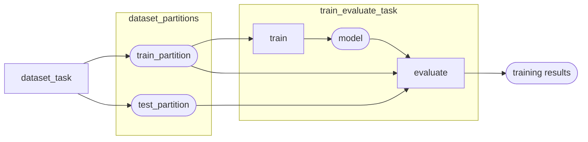
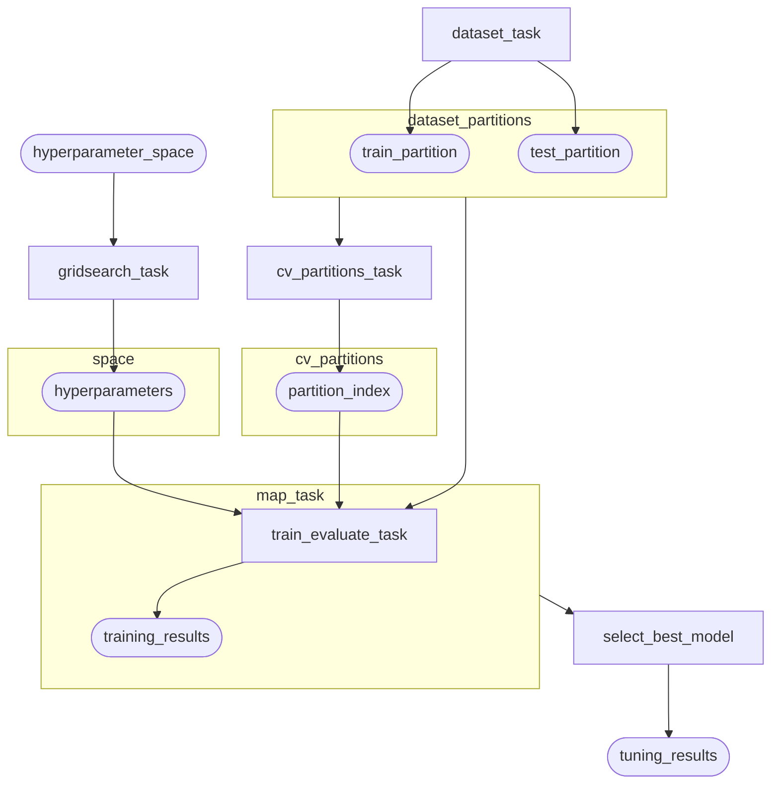

# RFC: Flytekit Native Model Training, Tuning, and Prediction Operators

**Status:** Open 🔘
**Deadline:** 9/10/2021

## Problem Statement

As a data scientist/machine learning engineer, I want an easy way of training a model and optimizing its hyperparameters so that I can reduce the boilerplate code needed to find the best model.

## Motivation

Currently, training an ML model in Flytekit requires building out custom tasks/workflows to manage everything from data partitioning to model optimization and evaluation. We do have several guides in `flytesnacks`, but there's an opportunity to reduce the boilerplate needed to write a model-training pipeline.

Additionally, although many hyperparameter optimization (auto-ml) frameworks exist out there, there's an opportunity for `flyte` to provide a native solution that takes advantage of Flyte propeller to distribute the tasks needed for hyperparameter optimization (and therefore enjoy the inspectability and reproducibility benefits of Flyte) instead of delegating the task to an external service like AWS Sagemaker or using an existing AutoML tool like [hyperopt](http://hyperopt.github.io/hyperopt/).

## MVP Proposal

Introduce a new Flytekit plugin `flytekit-learn`, which provides an interface for training and evaluating models using Flyte.

The central object of `flytekit-learn` is a `ModelTrainer` class that optimizes the parameters of an ML model and returns those parameters in addition to some training and test set metrics. The core offerings of the `flytekit-learn` plugin is to:

1. Train a single model with `ModelTrainer`
2. Tune a model based on a space of hyperparameters with `ModelTuner`
3. Deploy a model for generating predictions (offline at first, but support online later)

### `ModelTrainer`

Under the hood, `ModelTrainer` is a class that converts native Python code into a set of Flytekit tasks and workflows for training and evaluating a single model on some specified dataset.

### `ModelTuner`

`ModelTuner` is a class that compiles down to a [dynamic workflow](https://docs.flyte.org/projects/cookbook/en/latest/auto/core/control_flow/dynamics.html#sphx-glr-auto-core-control-flow-dynamics-py) that abstracts out the outer optimization loop that tunes hyperparameters based on some inner optimization routine (specified by the `ModelTrainer`), where the final optimal model is determined using an evaluation score of interest.

### `Predictor`

The `Predictor` class handles the deployment of a trained/tuned model to some production environment so that users can generate predictions. The MVP will support batch (offline) predictions in the form of a Flyte workflow, but future versions will look to integrate with external systems (e.g. Sagemaker, Seldon, etc) to allow for on-demand (online) predictions. The batch-style predictors might also support event-based or reactive triggering once Flyte's event-based/reactive scheduling is built out.

### Requirements

- The training API must be flexible enough to support the common ML frameworks, e.g. `sklearn`, `pytorch`, `tensorflow`, `xgboost`, etc.
- The user only needs to think about four things:
  1. How to get the dataset
  2. How to train a model on that dataset
  3. How to generate a prediction
  4. How to evaluate a trained model on some partition of the data.
- For the tuning API, the user needs to think about:
  1. The hyperparameter space
  2. The type of cross-validation to use
- Enable the user to express compute and run-time budgets, since most AutoML algorithms are "any-time" algorithms that can just keep running to find better hyperparameters (saturation dynamics are dataset- and model- dependent).

## Model Training API

The main idea is that the user implements three key functions and configures a `Dataset` object, and the `ModelTrainer` handles the rest:

```python
from typing import Any, Optional

from flytekit_learn import Dataset, Partition, Model, ModelTrainer, Evaluation

def train(
    hyperparameters: dict,
    train_partition: Partition,
    validation_partition: Optional[Partition] = None
) -> Model:
    """Train a model on specific hyperparameter settings.
    
    ModelTrainer supports functions where `validation_partition` is not
    specified in the function signature.
    """
    ...
    
def evaluate(model: Model, partition: Partition) -> Evaluation:
    """Evaluate the model on some partition of the data.
    
    This function is used to compute training and test scores during the
    training process.
    """
    ...

trainer = ModelTrainer(
    name="my_trainer",
    dataset=Dataset(
        training_url="s3://dataset/train.csv",
        validation_url=None,
        test_url=None,
        data_format="csv",
        test_size=0.2,
        shuffle=True
    ),
    train=train,
    evaluate=evaluate,
    hyperparameters={...},
    requests=Resources(...),  # like regular flytekit tasks
    limits=Resources(...),  # like regular flytekit tasks
    retries=3,
    # any other flyte-related resource configuration
)

# running the trainer locally
training_results: TrainingResults = trainer()

# or override default hyperparameters
training_results: TrainingResults = trainer(**hyperparameters)

```


You can see that `ModelTrainer` takes a few parameters:
- `dataset`: this is a `flytekit-learn` object, which compiles down to a Flytekit task that encapsulates feature and target data parsing, train/test data partitioning, and shuffling.
- `train`: a function that takes two arguments: `hyperparameters` and `partition`. The `Partition` type contains data for `features` and `targets`, where the `Dataset` handles the train and test set partitioning. `train` returns a `Model`, which is a higher-level type for ML models that abstract away the reading/writing of the model to/from disk. The `validation_partition` argument is optional and only passed in if the `Dataset` is configured explicitely with a `validation_url`.
- `evaluate`: a function that takes a partition and produces an `Evaluation`, which contains the evaluation `score` of interest to optimize for, as well as other `metrics` for reporting purposes.
- `hyperparameters`: a dictionary mapping hyperparameter names to values. The values can be overridden when a `ModelTrainer` instance is called.
- `requests/limits`: similar to regular Flytekit tasks.

`ModelTrainer` tasks return a `TrainingResults` object that contains the final model and evaluation metrics gathered during the training process.

Under the hood, the `ModelTrainer` class handles the conversion of the user-provided functions into tasks/workflows as necessary, and `my_trainer` should then be available as a workflow upon registration to be used by itself, or in other workflows.

#### Training API Architecture Overview

In terms of Flytekit tasks and workflows, the `ModelTrainer` compiles the user-provided functions/configuration into the following:

- `Dataset`: Flytekit task that copies data from remote source, partitions it into train/validation/test sets, and parses the features and targets
- `train`: function is converted into a Flyte task that takes hyperparameter settings and train/validation partitions as input, outputting a `Model` type.
- `evaluate`: function is converted into a Flyte `task` that takes `Model` and `partition` as input, and is called in the training and test set partitions.
- `ModelTrainer` itself maps onto a Flyte `workflow`, which orchestrates the flow of data in roughly the following way:

```python
Partitions = NamedTuple("Partitions", train=Partition, validation=Optional[Partition], test=Partition)

@task
def dataset_task() -> Partitions:
    """The Dataset class as a flytekit task."""
    ...  # parsing, preprocessing, partitioning
    return Partitions(train=train_partition, test=test_partition)
    
    
@task
def train_evaluate(hyperparameters: dict, partitions: Partitions) -> TrainingResults:
    """Training and evaluation are composed into a single flytekit task."""
    model = train(hyperparameters, partitions.train)
    return TrainingResults(
        train_metrics=evaluate(model, partitions.train),
        test_metrics=evaluate(model, partitions.test)
    )


@workflow
def model_trainer_workflow(hyperparameters) -> TrainingResults:
    partitions = dataset_task()
    return train_evaluate(
        hyperparameters=hyperparameters,
        partitions=partitions,
    )
```

Here's a high-level overview of the `ModelTrainer` workflow.



### Sklearn Example

Here's a basic example using `sklearn`.

```python
from flytekit_learn import Dataset, Partition, Model, ModelTrainer, Evaluation, TrainingResults
from sklearn.datasets import load_digits
from sklearn.ensemble import RandomForestClassifer
from sklearn.metrics import accuracy
    

def train(hyperparameters: dict, train_partition: Partition, validation_partition: Optional[Partition] = None) -> Model["sklearn"]:
    """The training function for a single set of hyperparameters."""
    model = RandomForestClassifer(**hyperparameters)
    model.fit(partition.features, partition.targets)
    return Model(
        model=model,
        train_score=...,
        validation_score=...,
        metadata={},  # arbitrary metadata
    )
    
    
def evaluate(model: Model["sklearn"], partition: Dataset) -> Evaluation:
    """
    This function can also return a dictionary with the expected keys and values:

    {
        "score": float,
        "metrics": Dict[str, float]
    }
    
    Flytekit will handle data conversions
    """
    return Evaluation(
        score=accuracy(
            partition.targets,
            model.predict(partition.features)
        ),
        # other metrics for reporting
        metrics={
            "roc": ...,
            "f1": ...,
            # etc.
        }
    )


trainer = ModelTrainer(
    dataset=Dataset(   
        training_url="s3://dataset/train.csv",
        data_format="csv",
        features=["col1", "col2"]
        targets=["target1", "target2"]
        test_size=0.2,  # hold-out test set to evaluate final model
        shuffle=True,
    ),
    hyperparameters={
        "n_estimators": 100,
        "max_depth": 3,
        "minsamples_leaf" : 3,
    }
    train=train,
    evaluate=evaluate,
    requests=Resources(...)  # like regular flytekit tasks
    limits=Resources(...)  # like regular flytekit tasks
)
```


## Model Tuning API

The `ModelTuner` provides Flyte-native hyperparameter optimization capabilities, taking advantage of all of Flyte's features such as caching, recoverability, etc. It builds on top of the `ModelTrainer`, and should be ML-framework-agnostic:

```python
from flytekit_learn import ModelTuner, GridSearch

my_trainer = ModelTrainer(
    name="my_trainer",
    dataset=Dataset(...),
    trainer=trainer,
    evaluator=evaluator,
    hyperparameters={
        "hp1": ...,
        "hp2": ...,
        "hp3": ...,
    },
    requests=Resources(...)  # like regular flytekit tasks
    limits=Resources(...)  # like regular flytekit tasks
    retries=3,
)

my_tuner = ModelTuner(
    name="my_tuner",
    model_trainer=my_trainer,
    hyperparameter_space=GridSearch(
        {
            "hp1": [...],
            "hp2": [...],
            "hp3": [...],
        },
    ),
    cross_validation=CrossValidation(k_folds=10),
    minimize=True,  # minimizes Evaluator.score value. If False, maximizes it
    requests=Resources(...)  # like regular flytekit tasks
    limits=Resources(...)  # like regular flytekit tasks
    runtime_budget=RuntimeBudget(
        max_epochs=10,
        max_runtime=10000,  # in seconds
    )
)
```

The two hyperparameter optimization algorithms provided by the MVP will be gridsearch and random search:

```python
GridSearch(
    {
        "hp1": [...],
        "hp2": [...],
        "hp3": [...],
    },
)

RandomSearch(
    {
        "hp1": [...],
        "hp2": [...],
        "hp3": [...],
    },
    seed=42,
    n_iterations=100,
)
```

As a general guideline, the underlying logic for cross validation and search algorithms will wrap the sklearn API that offers the same functionality, since these functions/methods are widely used and well-tested. Where appropriate, future offerings might need to implement certain functionality from scratch.

:::info
**NOTE:** Of course, the user can always use the `ModelTrainer` API to do hyperparameter tuning on their own using their hyperopt/automl framework of choice. However, this means that all of the separate training jobs occur within the scope of a single Flytekit task, as opposed to being orchestrated by Flyte propellor on a K8s cluster. Therefore, the `ModelTrainer` resources need to be properly configured to run however many training runs the user wants for doing e.g. grid search, random search, bayesian optimization, etc.
:::

#### Tuner API Architecture Overview

In terms of Flytekit tasks and workflows, the `ModelTuner` compiles the user-provided functions/configuration:

- `ModelTuner`: this class takes the `model_trainer`, `hyperparameter_space`, `cross_validation`, and other arguments to compose a workflow that orchestrates the running of individual model training and evaluation tasks, and selects the best model based on the `evaluate` function in the `ModelTrainer` object and the `minimize` argument.
   - For random search, grid search, and other embarrassingly parallel hyperparameter optimization algorithms, the hyperparameters are all sampled up-front and a map task is created from the user-provided functions in the `ModelTrainer`
   - For sequential algorithms that rely on the evaluation of some number of model training runs to inform how the hyperparameter space is sampled in subsequent runs (e.g. Bayesian optimization), the model tuner creates a `dynamic` workflow.
- `CrossValidation`: cross validation is handled in one of two ways:
  - If the user provides a static validation set with the `validation_url` argument, a single validation performance metric will be used to determine the best model.
  - If the user specifies a `CrossValidation` object, the underlying tasks/workflows in `ModelTuner`, will handle the training/validation partitions with a `PartitionIndex`, i.e. the training task will receive an object that specifies the index of the training and validation sets for a particular training run. The mean validation performance over the `k` validation sets will be used to determine the best model.

:::info
`PartitionIndex` avoids the inefficiency of making a large number of copies of the data during the cross validation process. Instead of duplicating data over `k` folds, an index over the training data is created to keep track of which rows are in the (cross validation) training set and which are in the validation set.
:::

**`GridSearch` example**

Below is an example of the underlying Flyte tasks/workflows that would make up a grid search model tuning routine.

```python
import itertools
from Flytekit import task, map_task, workflow

MapInput = NamedTuple(
    "MapInput",
    hyperparameters=dict,
    partitions=Partitions,
    cv_partition=PartitionIndex,
)

@task
def gridsearch_task(hyperparameter_space: GridSearch) -> List[dict]:
    """Enumerates all possibilities in the hyperparameter space."""
    ...
    
@task
def cv_partitions_task(partitions: Partitions, k_folds: int = 5) -> List[PartitionIndex]:
    """Create virtual partitions for cross validation."""
    ...
    
@task
def prepare_map_input(
    space: List[dict],
    partitions: Partitions,
    cv_partitions: List[PartitionIndex]
) -> List[MapInput]:
    """Make mappable input for the map task."""
    return [MapInput(h, partitions, vp) for h in space for vp in cv_partitions]
    
@task
def mappable_train_evaluate(map_input: MapInput):
    """A mappable version of train and evaluate task."""
    # the PartitionIndex object can be used to split the training set into training
    # and validation sets.
    train_partition, validation_partition = map_input.cv_partition.split(
        map_input.partitions.train
    )
    model = train(map_input.hyperparameters, train_partition, validation_partition)
    return TrainingResults(
        train_metrics=evaluate(model, train_partition,
        validation_metrics=evaluate(model, validation_partition),
        test_metrics=evaluate(model, map_input.partitions.test)
    )
    
@task
def select_best_model(gridsearch_results: List[TrainingResults], minimize: bool) -> TuningResults:
    """Get the best training results """
    ...
        

@workflow
def model_tuning_workflow(
    hyperparameter_space,
    minimize: bool = True,
    k_folds: int, k_folds,
) -> TuningResults:
    partitions = dataset_task()

    gridsearch_results = map_task(mappable_train_evaluate)(
        map_input=prepare_map_input(
            space=gridsearch_task(hyperparameter_space),
            cv_partitions=cv_partitions_task(
                partitions=partitions, k_folds=k_folds
            )
        )
    )
    return select_best_model(
        gridsearch_results=gridsearch_results,
        minimize=minimize,
    )
    
```

Here's a high-level overview of the `ModelTuner` API for embarrassingly parallel hyperparameter optimization algorithms.




### Prediction API

The main use case of the prediction API is to generate batch predictions for use in some production process. The rationale for separating the training process and the prediction process is that the final form of the prediction to be used in a business context is often different from the prediction generated for the purpose of model training.

For example, say we have a neural net that outputs softmax probabilities of `k` number of categories. In the model training phase, we want the full probability distribution of the `k` classes. However, the business case could be to output only the most probable class.

Additionally, there is variability in the way that training/test data is collected during the training process, and the way feature data is collected for prediction in production.

```python
from flytekit_learn import Predictor


def preprocessor(raw_features: Any) -> Any:
    """Preprocesses raw feature data from a data source."""
    ...
    
def predictor(model: Model, features: Any) -> Any:
    """Generate predictions from the specified trainer/tuner"""
    ...
    

my_predictor = Predictor(
    name="my_predictor"
    preprocessor=preprocessor,  # optional. If not provided, this function is lambda x: x
    predictor=predictor,  # required
    # specify one of:
    model_trainer=my_trainer,
    # or
    model_tuner=my_tuner,
    # an explicit reference to a specific trainer/tuner execution.
    # If None, gets the latest id.
    # Fails if no executions exist.
    trainer_execution_id=None,
    tuner_execution_id=None,
)
```

The reason we need to specify `my_trainer` or `my_tuner` instead of, say, the output of calling the trainer/tuner, is that `Predictor` doesn't have access to those outputs when it's defined at compile time. Therefore, the user needs to specify a `ModelTrainer` or `ModelTuner` instance, which points to particular trainer/tuner workflow.

Under the hood, `predictor` compiles into a Flytekit workflow that will be available to execute locally or on a remote backend.

**Usage**:

A `Predictor` instance can be used in one of several ways:

1. Called within a custom `@workflow`

```python
@workflow
def prediction_wf():
    features = get_features()  # custom a task
    predictions = my_predictor(features=features, trainer_execution_id=None)
    write_predictions(predictions=predictions)  # another custom task
```


2. Called locally

```python
# purely for local debugging
predictions = my_predictor(features=[*features])
```

3. Executed with the `FlyteRemote` API

```python
# also mainly for debugging
remote = FlyteRemote(...)
my_predictor = remote.get_workflow(name="my_predictions")
remote.execute(my_predictor, inputs={"features": [*features]})
```

In any case, the user is responsible for fetching the data from some source and writing it to another source where it needs to be consumed.

Once specific use-cases are solidified, the `Predictor` API may be expanded to incorporate prediction use cases that handle reading and writing of data from/to particular locations.


## Flexibility in `Dataset` Definition

### Single Data Source

The `Dataset` class should support multiple ways of setting up training data. The first way is to provide a `training_url` to a single data source, as shown in the examples above. This assumes a single tabular or record-like datasource where `Dataset` can handle target and feature parsing and train/test set partitioning.

```python
Dataset(   
    training_url="s3://dataset/train.csv",
    data_format="csv",
    features=["col1", "col2"]
    targets=["target1", "target2"]
    test_size=0.2,  # hold-out test set to evaluate final model
    shuffle=True,
),
```

### Pre-partitioned Data Sources

The other approach is to support separate pre-partitioned dataset:

```python
Dataset(   
    training_url="s3://dataset/train.csv",
    test_url="s3://dataset/test.csv",
    data_format="csv",
    features=["col1", "col2"]
    targets=["target1", "target2"]
    shuffle=True,
),
```

### Query-based Data Sources

With the [flytekit sql plugins](https://docs.flyte.org/projects/cookbook/en/latest/auto/integrations/flytekit_plugins/sql/index.html) the `Dataset` class should also support query-based datasets. This example uses the `SQlite3Task` operator:

```python
from flytekit.extras.sqlite3.task import SQLite3Config, SQLite3Task

EXAMPLE_DB = "https://url/to/dataset.zip"
# DB has the table "dataset":
# - uuid: str [PRIMARY_KEY]
# - y: int
# - x1: int
# - x2: int
# - x3: int
# - partition: {"train", "test"}

sqlite_task = SQLite3Task(
    name="example_sqlite3_task",
    query_template="""
        SELECT id, x1, x2, x2, y FROM dataset
        WHERE partition = '{{.inputs.partition}}'
    """,
    inputs=kwtypes(partition=str),
    output_schema_type=FlyteSchema[kwtypes(uuid=str, x1=int, x2=int, x3=int, y=int)],
    task_config=SQLite3Config(uri=EXAMPLE_DB, compressed=True),
)


query_dataset = Dataset(
    query_template=sqlite_task,
    data_format="sqlite",  # "sqlite", "sqlachemy" for query-based datasets
    training_query_inputs={"partition": "train"},
    test_query_inputs={"partition": "test"},
    targets=["y"],
    features=["x1", "x2", "x3"],
    unique_id="uuid",
)
```

### User-handled Processing of Data with `Dataset(..., lazy=True)`

Finally, for ultimate flexibility, users can provide the `lazy=True` argument to define custom dataloading behavior by implementing the data-loading logic in the `train` and `evaluate` functions. This pattern is useful when using frameworks like `tensorflow` and `pytorch`, which requires loading batches of data (often lazily due to memory constraints) and iteratively performing model updates.

Here's an example of a dataset that points to pre-partitioned s3 directories where the training procedure requires batches of data to be loaded. When `lazy=True`, the `Partition` object only provides a `path` property that the user is responsible for parsing out into the features and targets:

```python
from flytekit_learn import Dataset, Partition, Model

import torch


lazy_dataset = Dataset(
    training_url="s3://dataset/train",
    test_url="s3://dataset/test",
    data_format="directory",
    lazy=True,
)


class PytorchModel(torch.nn.Module):
    ...


class PytorchDataset(torch.utils.data.Dataset):
    
    def __init__(self, path):
        self.path = path
        
    # implement __len__ and __getitem__, see
    # https://pytorch.org/tutorials/beginner/data_loading_tutorial.html#
    
    
class PytorchDataLoader(torch.utils.data.DataLoader):
    ...
    
    # implement other required methods
    # see https://pytorch.org/tutorials/beginner/data_loading_tutorial.html#


def trainer(
    hyperparameters: dict,
    train_partition: Partition,
    validation_partition: Optional[Partition] = None,
) -> Model["pytorch"]:
    model = PytorchModel(**hyperparameters)  # a pytorch model
    # the Partition object exposes a path property pointing to a local
    # copy of the training set.
    train_dataloader = PytorchDataLoader(PytorchDataset(train_partition.path))        
    opt = torch.optim.SGD(net.parameters())
    for x, y in train_dataloader:
        # update model
        y_hat = model(x)
        loss = loss_fn(y_hat, y)
        opt.zero_grad()
        loss.backward()
        opt.step()
        # etc...
    
    return model
        
        
def evaluate(model: Model["pytorch"], partition: Partition):
    dataloader = PytorchDataLoader(
        # the Partition object exposes a path property pointing to a local
        # copy of the training set.
        PytorchDataset(partition.path)
    )
    for x, y in dataloader:
        y_hat = model(x)
        loss = loss_fn(y_hat, y)
        # etc ...
```

Note that if `lazy=True`, the `test_url` argument must be provided, since the `flytekit_learn.Dataset` doesn't implicitly know how to split up the data beforehand.

As the `flytekit-learn` plugin matures, some of these dataset-loading use-cases may be offered as first-class citizens.


### Using `Dataset(..., lazy=True)` in Model Tuning

When tuning a model's hyperparameters, you typically want a validation set as well, which is used to select the best model. This best model is then evaluated on the test set to produce the most accurate estimate of generalization performance.

When a single model-training run is computationally expensive, you typically want to produce a pre-partitioned validation set since k-fold cross validation introduces a multiplicative effect on the computational requirements of your model-tuning routine. Therefore it makes sense to support a `validation_url` argument in the `Dataset` constructor so that this can be used by the `ModelTuner` to compute the validation score on a particular set of hyperparameters:

```python
lazy_dataset = Dataset(
    training_url="s3://dataset/train",
    validation_url="s3://dataset/validation",
    test_url="s3://dataset/test",
    lazy=True,
)

tuner = ModelTuner(
    trainer=ModelTrainer(dataset=lazy_dataset, ...)
)
```

### Object-oriented API

For users who are more familiar with OO-style programming, the `ModelTrainer` can be subclassed and the `trainer` and `evaluator` functions can be implemented as methods:

```python
class MyTrainer(ModelTrainer):

    # optional __init__ method to hold additional state
    def __init__(self, additional_param, **kwargs):
        super().__init__(**kwargs)
        self.additional_param = additional_param
    
    def train(self, hyperparameters, train_partition, validation_partition):
        ...
        
    def evaluate(self, model, partition):
        ...


my_trainer = MyTrainer(additional_param, **kwargs)
```

The main advantage of this approach is the support of additional state in the `__init__` method that is made available to the user in the `train` and `evaluate` methods.

The `ModelTuner` and `Predictor` will similarly have OO-style interfaces.


## Appendix: Post MVP

### Other AutoML Algorithms

The simplest hyperparameter optimization routine is gridsearch/random grid search, which the MVP `ModelTuner` will use. However, there are many extensions to build on top of this, such as support for other hyperparameter tuning algorithms like [Successing Halving](https://scikit-learn.org/stable/modules/grid_search.html#successive-halving-user-guide), [Hyperband](https://arxiv.org/abs/1603.06560), and [Bayesian Optimization](https://scikit-optimize.github.io/stable/auto_examples/bayesian-optimization.html), which are faster at searching the hyperparameter space (therefore saving the user's time and compute resources).

### Support Distributions in AutoML Algorithms

Instead of only supporting finite lists of values in the hyperparameter space, it would also make sense to support the specification of distributions, e.g. uniform, normal, etc. Automl algorithms like random search would then sample from these distributions to obtain hyperparamater settings using model tuning.

### Framework-specific Trainers

If we can pre-build docker images for certain ML frameworks, we could then support an even simpler API, like:

```python
sklearn_trainer = SklearnTrainer(
    name="random_forest_trainer",
    dataset=Dataset(...),  # still need to supply the dataset
    estimator="sklearn.ensemble.RandomForestClassifier",
    hyperparameters={...},
    scorer="accuracy",
    metrics=["f1_score", "precision", "recall"],
    sklearn_version="0.24.2",
)
```

Where `SklearnTrainer` implements the `trainer` and `evaluator` functions.


### `Dataset` Subclasses for Other User Cases

The `Dataset` class as described above only supports either tabular/record-like datasets,
or offloads the dataset construction logic to the user with the `lazy=True` option.
A better UX would be to support additional use cases out-of-the-box so that users
don't have to implement everything from scratch.


### Event-based and Online Predictors

The MVP will support batch prediction as a Flyte workflow, but there are many cases in which we want to (i) trigger a prediction based on some event or (ii) call an API endpoint with a request to generate a prediction. (i) can be fulfilled by [reactive event workflows](https://docs.google.com/document/d/1AfegI-3-IzNVnbqTiVmQXcQ-3rJC0ugiz9BdGuGAmIA/edit#heading=h.16z861596wrr), which is on the Flyte roadmap, and (ii) will require integrating with external services like `Sagemaker` and `Seldon`.


### Task-based AutoML

There are two types of auto-ml solutions out there:

1. Given a dataset, optimize hyperparameters of a single model type, where the use needs to specify the model type and hyperparameter space, e.g. [hyperopt](https://github.com/hyperopt/hyperopt)
2. Given a dataset, find the best model based on task type, e.g. [ludwig](https://github.com/ludwig-ai/ludwig).

The `ModelTuning` API described in this RFC is of type (1). In theory, it would be possible to offer a Flytekit-native type (2) solution, where the user only has to specify the dataset and the task type (ludwig one-ups other such libraries by inferring task type based on the data type of the target variable(s)). For example:

```python
automl_trainer = AutoMLTrainer(
    name="automl_trainer",
    dataset=Dataset(
        features={
            "x1": int,
            "x2": int,
            "x3": int,
        },
        targets={
            "y": bool,  # infer binary classification
        }
    ),
    # or, if feature/target data types are not provided:
    task="classification",
    objective="accuracy",
)
```

However, there are many open questions underlying the design of such a system, like:
1. Use a single ML framework, e.g. tensorflow? (ludwig does this), or use multiple different frameworks?
2. How to effectively search the model **and** hyperparameter space?
3. How to encode non-primitive data types like images, unstructured text, etc?
