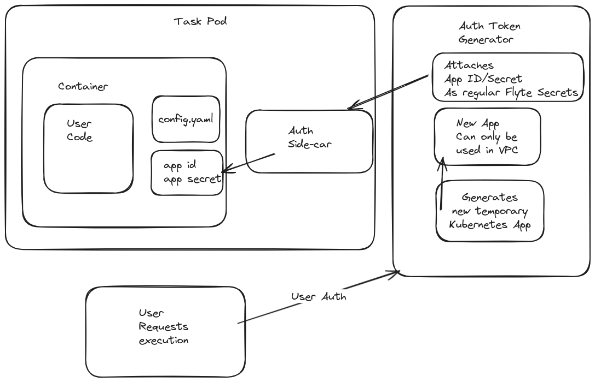

# [RFC Template] Flyte Authentication in Tasks

**Authors:**

- @zeryx

## 1 Executive Summary

This RFC proposes a method to flow Flyte authentication information into task containers. 
It aims to simplify access to execution-specific information and enable secure, streamlined usage of Flyte features within tasks. 
The proposal introduces a Flyte Auth Agent system to bind the authentication context of the task/workflow executor to all executed tasks.

## 2 Motivation

- In many workflows, accessing execution-specific information (e.g., used images, versions) is crucial. 
- Tasks often need to interact with Flyte for remote registration or to use Flyte features (e.g., pyflyte register, build, project creation).
- In order to access today, you're required to create a Kubernetes App, recording its ID and secret key, and then passing these to a Flyte Task. 
- This approach is either insecure (plaintext files) or overly complex (Kubernetes Secrets).
- Additionally, it requires the user to manually create and manage the App, which is a tedious process.

## 3 Proposed Implementation


- **Flyte Auth Agent System:** Introduce a Flyte Auth Agent to bind the authentication of the task/workflow executor to all tasks.
- **Automatic Binding:** The bound authentication, possibly provided as mounted environment variables, will be automatically accessible within Flytekit.
- **Simplified Task Authorization:** Tasks will inherit the permissions of the workflow executor, ensuring a secure and streamlined permission model.
- **Enhanced Eager Mode:** Support for Eager Mode, enabling tasks to trigger downstream tasks securely without needing plaintext credentials or creating cloud-specific secrets.

### Client-side integration example
```python
from flytekit import task, remote
from typing import Optional

# No task arguments are required; this behavior would be automatic
@task
def get_execution_date(execution_id: str) -> Optional[str]:
    # The Flyte Auth Agent will automatically bind the authentication of the task executor to this context
    context = remote.default()
    # Behind the scenes, we would have a config.yaml (or similar) that would point to this Flyte deployment, and the agent would use that to authenticate
    execution = context.fetchExecution(execution_id)
    if execution.closure.phase == "SUCCEEDED":
        return execution.closure.started_at.isoformat()
    else:
        return None
```


### Client-side integration example (Eager Mode)

```python
from flytekit import task, remote, eager

@task
def say_hello(name: str) -> str:
    """A simple Flyte task to say "hello".

    The @task decorator allows Flyte to use this function as a Flyte task, which
    is executed as an isolated, containerized unit of compute.
    """
    return f"hello {name}!"

## No longer required to create a FlyteRemote, as it's automatically available within the task.
# remote = FlyteRemote(
#     config=Config.for_sandbox(),
#     default_project="flytesnacks",
#     default_domain="development",
# )

@eager(remote=remote.default())
async def hello_main(name: str = "flyte") -> str:
    results = await say_hello(name=name)
    return results


```

## 5 Drawbacks

- This proposal requires a new system to be built and maintained.
- 

## 6 Alternatives

*What are other ways of achieving the same outcome?*

## 7 Potential Impact and Dependencies

*Here, we aim to be mindful of our environment and generate empathy towards others who may be impacted by our decisions.*

- *What other systems or teams are affected by this proposal?*
- *How could this be exploited by malicious attackers?*

## 8 Unresolved questions

*What parts of the proposal are still being defined or not covered by this proposal?*

## 9 Conclusion

*Here, we briefly outline why this is the right decision to make at this time and move forward!*

## 10 RFC Process Guide, remove this section when done

*By writing an RFC, you're giving insight to your team on the direction you're taking. There may not be a right or better decision in many cases, but we will likely learn from it. By authoring, you're making a decision on where you want us to go and are looking for feedback on this direction from your team members, but ultimately the decision is yours.*

This document is a:

- thinking exercise, prototype with words.
- historical record, its value may decrease over time.
- way to broadcast information.
- mechanism to build trust.
- tool to empower.
- communication channel.

This document is not:

- a request for permission.
- the most up to date representation of any process or system

**Checklist:**

- [ ]  Copy template
- [ ]  Draft RFC (think of it as a wireframe)
- [ ]  Share as WIP with folks you trust to gut-check
- [ ]  Send pull request when comfortable
- [ ]  Label accordingly
- [ ]  Assign reviewers
- [ ]  Merge PR

**Recommendations**

- Tag RFC title with [WIP] if you're still ironing out details.
- Tag RFC title with [Newbie] if you're trying out something experimental or you're not entirely convinced of what you're proposing.
- Tag RFC title with [RR] if you'd like to schedule a review request to discuss the RFC.
- If there are areas that you're not convinced on, tag people who you consider may know about this and ask for their input.
- If you have doubts, ask on [#feature-discussions](https://slack.com/app_redirect?channel=CPQ3ZFQ84&team=TN89P6GGK) for help moving something forward.
